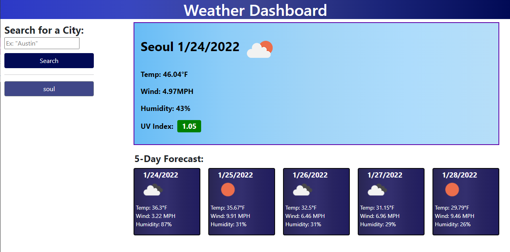
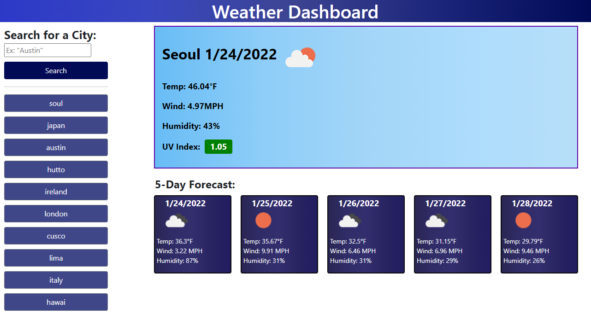

# Homework Unit Six:
# Weather Dashboard

## Description of the homework:

In this homework, I created a weather dashboard application using [OpenWeather One Call API](https://openweathermap.org/api/one-call-api). This application  displays current weather and forecasts weather for the next 5 days of a city chosen by the user. The user search history is saved and displayed on the side of the page for easy access to search again.  

The page displays a search button below the text box to input the city to be searched. After the button is pressed, the current weather will be displayed on the right side of the page. The forecast of the next 5 days will be displayed on the bottom right of the page. The user search history is saved on the localStorage and is displayed on the left side of the page for easy access if user wants to search again.  

### Link to application [HERE](https://marymd98.github.io/Unit6-Homework/)

## Screenshot  of Coding Quiz Challenge:
Below are screenshots of the Quiz Challenge 

